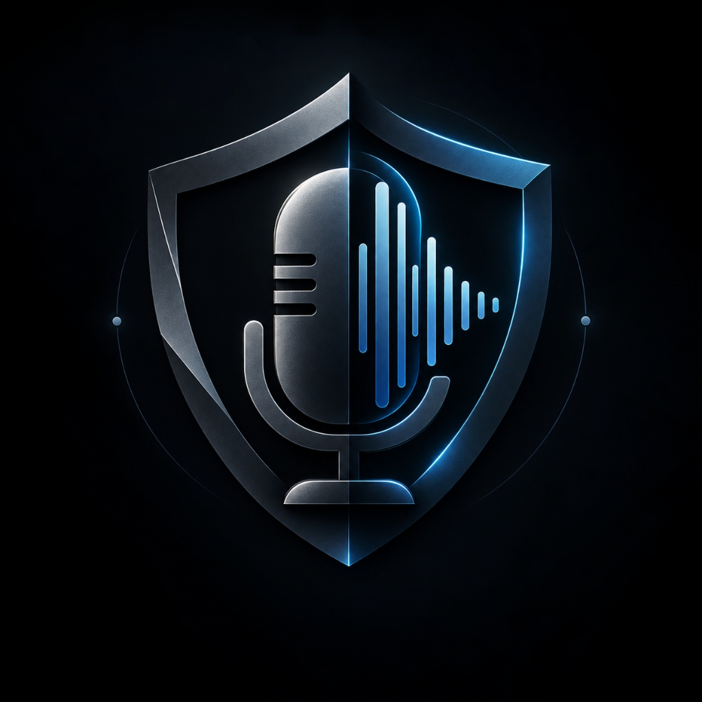

<p align="center">
  
</p>

<h1 align="center">VoiceGuard</h1>
<h3 align="center">AI/Clone Voice and Deepfake Detector</h3>

<p align="center">
  <em>"Real Voices. A Safer Tomorrow."</em>
</p>

<p align="center">
  
  
  
  
  
  
  
  
</p>

---

## 🌐 Live Production Deployments & Access

VoiceGuard is publicly deployed and accessible online across cloud-hosted frontend and backend microservices:

| Service | Deployment URL | Status & Description |
| :--- | :--- | :--- |
| **Frontend Workstation** | [https://voiceguard-app.onrender.com](https://voiceguard-app.onrender.com) | Production Dark UI with real-time waveform inspection, live microphone streaming, and PDF export |
| **Backend Forensic API** | [https://voiceguard-ai-voice-clone-deepfake.onrender.com](https://voiceguard-ai-voice-clone-deepfake.onrender.com) | FastAPI cloud microservice with real-time audio analysis and WebSocket telemetry stream |
| **Interactive API Docs** | [Swagger Documentation](https://voiceguard-ai-voice-clone-deepfake.onrender.com/docs) | OpenAPI interactive explorer and endpoint schema validation |
| **Health Check Endpoint** | [/health Probe](https://voiceguard-ai-voice-clone-deepfake.onrender.com/health) | Uptime telemetry and zero-persistence container monitoring |

### 🚀 Project Overview & Live Access
**VoiceGuard** is an open-source, enterprise-grade biometric audio forensics system engineered to detect synthetic voice clones, AI-generated speech, and audio deepfakes in both **pre-recorded files** and **live microphone streams**.

By combining deep neural sequence representations (`Wav2Vec2`) with mathematical signal-processing heuristics (`Librosa`), VoiceGuard exposes acoustic artifacts invisible to the human ear—such as phase incoherence, micro-jitter absence, unnatural spectral flatness, and missing breath intervals—providing transparent, court-admissible forensic insights rather than opaque black-box verdicts.

🔗 **Access the Deployed Project:**  
👉 **[Launch VoiceGuard Live Application: https://voiceguard-app.onrender.com](https://voiceguard-app.onrender.com)**

---

## 📌 Table of Contents
- [Live Production Deployments & Access](#-live-production-deployments--access)
- [Executive Overview](#-executive-overview)
- [Why VoiceGuard?](#-why-voiceguard)
- [Key Capabilities & Features](#-key-capabilities--features)
- [Architecture & Detection Pipeline](#-architecture--detection-pipeline)
- [Heuristic & Signal-Processing Explainability](#-heuristic--signal-processing-explainability)
- [Tech Stack](#-tech-stack)
- [Project Directory Structure](#-project-directory-structure)
- [Quickstart & Installation Guide](#-quickstart--installation-guide)
  - [Prerequisites](#prerequisites)
  - [1. Backend Setup](#1-backend-setup)
  - [2. Frontend Setup](#2-frontend-setup)
- [API Reference](#-api-reference)
  - [REST Endpoints](#rest-endpoints)
  - [WebSocket Endpoint](#websocket-endpoint)
- [Zero-Retention Biometric Privacy Guarantee](#-zero-retention-biometric-privacy-guarantee)
- [Contributing & Code of Conduct](#-contributing--code-of-conduct)
- [License](#-license)

---

## 🛡️ Executive Overview

**VoiceGuard** is an open-source, enterprise-grade biometric audio forensics system engineered to detect synthetic voice clones, AI-generated speech, and audio deepfakes in both **pre-recorded files** and **live microphone streams**.

By combining deep neural sequence representations (`Wav2Vec2`) with mathematical signal-processing heuristics (`Librosa`), VoiceGuard exposes acoustic artifacts invisible to the human ear—such as phase incoherence, micro-jitter absence, unnatural spectral flatness, and missing breath intervals—providing transparent, court-admissible forensic insights rather than opaque black-box verdicts.

---

## 🚨 Why VoiceGuard?

Modern generative text-to-speech (TTS) and voice conversion models (e.g., ElevenLabs, RVC, Bark, XTTS, Tortoise, DiffSinger) can clone a human voice using less than 3 seconds of reference audio. This technology has fueled:
- **Emergency Impersonation ("Grandparent Scams")**: Urgent calls demanding bail or wire transfers using synthetic family voices.
- **Executive Authorization Fraud**: CEO audio deepfakes authorizing fraudulent banking and wire transactions.
- **Automated Social Engineering**: High-scale robocalls circumventing traditional IVR security.

Traditional spam filters and human ears fail against high-fidelity neural vocoders. **VoiceGuard fills this detection gap** with instant, explainable, and privacy-first acoustic analysis.

---

## ✨ Key Capabilities & Features

| Capability | Technical Implementation | Value |
| :--- | :--- | :--- |
| **Dual-Engine Fusion** | Pretrained sequence classification + multi-band acoustic DSP | Detection against both known and out-of-distribution neural vocoders |
| **Continuous Calibrated Probabilities** | Logit temperature scaling ($T = 3.0$) | Eliminates false 100% / 0% saturation; displays honest confidence |
| **Real-Time Live Mic Streaming** | Sub-second rolling WebSockets + VAD silence gating | Continuous call center, security checkpoint, and conversation screening |
| **Dynamic Forensic Summaries** | Diagnostic synthesis engine extracting exact acoustic metrics | Clear, human-readable explanations citing jitter, entropy, and respiration |
| **Audit-Ready PDF Reports** | Client-side cryptographic SHA-256 checksums + visual spectrograms | Archival-ready compliance reports for legal and forensic documentation |
| **Zero-Retention Biometric Privacy** | Ephemeral in-memory RAM processing without database persistence | 100% compliant with GDPR, CCPA, and global biometric regulations |
| **Built-in Benchmark Library** | Curated pairs of authentic vs cloned audio clips | Zero-setup demonstrations and model validation out of the box |
| **Interactive Knowledge Base** | Dedicated searchable FAQ and formal forensic Terms & Conditions | Clear operational guidance and ethical usage boundaries |

---

## 🏗️ Architecture & Detection Pipeline

```
                                  VOICEGUARD DETECTION PIPELINE
                                  
  [ Audio File / Live Mic ]
              │
              ▼
   ┌──────────────────────┐
   │ Audio Preprocessing  │ ────► Resample to 16 kHz Mono | Normalization | VAD Gating
   └──────────────────────┘
              │
      ┌───────┴────────────────────────┐
      ▼                                ▼
┌───────────────────────────┐    ┌───────────────────────────────┐
│   Deep Neural Classifier  │    │     Acoustic DSP Heuristics   │
│   (Wav2Vec2 Architecture) │    │      (Librosa Signal Chain)   │
│                           │    │                               │
│  • Latent feature vectors │    │  • Pitch Jitter Variance (F0) │
│  • Cross-entropy logits   │    │  • Spectral Flatness (Wiener) │
│  • Raw logit margin: Δz   │    │  • Respiration & Pause Ratio  │
│  • Temperature scaling:   │    │  • Spectral Centroid / Roll   │
│    σ((z1 - z0) / 3.0)     │    │  • Harmonic-to-Noise Ratio    │
└───────────────────────────┘    └───────────────────────────────┘
              │                                │
              └───────────────┬────────────────┘
                              ▼
               ┌───────────────────────────────┐
               │    Dual-Engine Fusion Core    │
               │  Confidence = 0.75M + 0.25H   │
               └───────────────────────────────┘
                              │
              ┌───────────────┴───────────────┐
              ▼                               ▼
  ┌─────────────────────────┐     ┌─────────────────────────────┐
  │  Diagnostic Summary     │     │  Cryptographic Report       │
  │  • Metric Telemetry     │     │  • SHA-256 Audio Hash       │
  │  • Fraud Risk Guidance  │     │  • PDF Export Generation    │
  └─────────────────────────┘     └─────────────────────────────┘
```

---

## 🔬 Heuristic & Signal-Processing Explainability

VoiceGuard does not rely solely on neural black-box weights. Every analysis runs four discrete mathematical acoustic tests:

1. **Laryngeal Pitch Micro-Jitter ($F_0$ Variance)**
   - *Theory*: Natural human vocal cords exhibit natural involuntary frequency perturbation (jitter).
   - *Detection*: Calculated via parabolic-interpolated autocorrelation / probabilistic YIN (`librosa.pyin`). Unnaturally static or mathematically flat pitch paths flag synthetic vocoder generation.
2. **Spectral Flatness & Wiener Entropy**
   - *Theory*: Evaluates the ratio between the geometric mean and arithmetic mean of power spectral densities.
   - *Detection*: Synthetic neural vocoders often produce artificially smooth spectral envelopes or excessive white noise floors across higher frequency bands ($>4 \text{ kHz}$).
3. **Respiration Cadence & Dynamic Pause Ratios**
   - *Theory*: Biological speakers take non-uniform physiological inhalation and exhalation breaks during continuous speech.
   - *Detection*: Voice Activity Detection (VAD) energy thresholding identifies missing breath pauses or unnaturally robotic cadence.
4. **Spectral Centroid & High-Frequency Energy Distribution**
   - *Theory*: Measures the frequency "center-of-mass".
   - *Detection*: Detects artificial high-frequency roll-offs or harsh vocoder cutoffs common in low-bitrate neural synthesizers.

---

## 💻 Tech Stack

### Backend
- **Runtime**: Python 3.10 / 3.11
- **API Framework**: FastAPI, Uvicorn (`uvicorn[standard]`)
- **Neural Modeling**: PyTorch, HuggingFace Transformers (`MelodyMachine/Deepfake-audio-detection-V2`), Torchaudio
- **Audio Signal Processing**: Librosa, SoundFile, NumPy, SciPy
- **Networking**: WebSockets, Asyncio, Python-Multipart

### Frontend
- **Framework**: React 18 (Vite build tool)
- **Styling**: Cyberpunk-industrial workstation theme (`#080B10`, `#0D1117`, `#22A7D6`)
- **Icons**: Lucide React
- **Web Audio API**: Real-time microphone capture (`AudioContext`, `MediaStream`, PCM chunking)
- **Export Engine**: `jspdf` + `jspdf-autotable` with SHA-256 hashing

---

## 📂 Project Directory Structure

```
VoiceGuard/
├── backend/
│   ├── main.py              # FastAPI application, REST & WebSocket routes
│   ├── analysis.py          # Unified dual-engine fusion pipeline & summary builder
│   ├── heuristics.py        # DSP algorithms (jitter, spectral flatness, pauses)
│   ├── requirements.txt     # Backend dependencies
│   └── demo_clips/          # Bundled authentic & synthetic benchmark audio pairs
│       ├── real_1.wav       # Authentic benchmark voice sample 1
│       ├── real_2.wav       # Authentic benchmark voice sample 2
│       ├── fake_1.wav       # Synthetic clone benchmark sample 1
│       └── fake_2.wav       # Synthetic clone benchmark sample 2
├── frontend/
│   ├── public/
│   │   ├── logo.png         # VoiceGuard official logo
│   │   └── favicon.svg      # Favicon asset
│   ├── src/
│   │   ├── components/
│   │   │   ├── SplashScreen.jsx   # Opening transition splash screen
│   │   │   ├── Sidebar.jsx        # Navigation shell with logo branding
│   │   │   └── TopBar.jsx         # Header status & system reset controls
│   │   ├── views/
│   │   │   ├── OverviewView.jsx   # Dashboard metrics & quick-start panel
│   │   │   ├── AnalyzeView.jsx    # File upload, telemetry card, PDF export
│   │   │   ├── LiveView.jsx       # Real-time WebSocket microphone scanner
│   │   │   ├── SamplesView.jsx    # Curated benchmark comparison laboratory
│   │   │   ├── HistoryView.jsx    # Session analysis audit log
│   │   │   ├── ReportsView.jsx    # Saved forensic PDF report repository
│   │   │   ├── HowItWorksView.jsx # Forensic methodology technical paper
│   │   │   ├── DocumentationView.jsx # API integration & architecture specs
│   │   │   ├── FaqView.jsx        # Searchable FAQ resolving all operational doubts
│   │   │   └── TermsView.jsx      # Legal terms, biometric privacy & compliance
│   │   ├── api.js                 # Axios REST client & WebSocket manager
│   │   ├── App.jsx                # Main workstation shell & router
│   │   └── main.jsx               # React entry point
│   ├── package.json
│   └── vite.config.js
└── README.md
```

---

## 🚀 Quickstart & Installation Guide

### Prerequisites
- **Python**: Version `3.10` or `3.11` installed
- **Node.js**: Version `18.x` or higher installed
- **Git**: Installed
- **Microphone**: (Optional) For real-time streaming mode

---

### 1. Backend Setup

```bash
# 1. Navigate to the backend directory
cd backend

# 2. (Recommended) Create and activate a virtual environment
python -m venv venv

# Windows:
.\venv\Scripts\activate

# Linux / macOS:
source venv/bin/activate

# 3. Install required Python packages
pip install -r requirements.txt

# 4. Launch the FastAPI server
uvicorn main:app --host 127.0.0.1 --port 8000 --reload
```

> **Note**: On the first launch, the pretrained neural model (~350 MB) will be downloaded from HuggingFace and cached locally for offline execution.

Verify backend health at: [http://127.0.0.1:8000/health](http://127.0.0.1:8000/health)

---

### 2. Frontend Setup

```bash
# 1. In a separate terminal, navigate to the frontend directory
cd frontend

# 2. Install dependencies
npm install

# 3. Launch the Vite development workstation
npm run dev
```

Open your browser and navigate to: **[http://localhost:5173](http://localhost:5173)**

---

## 📡 API Reference

- **Production REST Base URL**: `https://voiceguard-ai-voice-clone-deepfake.onrender.com`
- **Production WebSocket URL**: `wss://voiceguard-ai-voice-clone-deepfake.onrender.com/ws/stream`
- **Interactive Swagger Explorer**: `https://voiceguard-ai-voice-clone-deepfake.onrender.com/docs`
- **Local Base URL**: `http://127.0.0.1:8000`

### REST Endpoints

#### 1. Analyze Audio File
- **Route**: `POST /analyze` (Cloud: `https://voiceguard-ai-voice-clone-deepfake.onrender.com/analyze`)
- **Content-Type**: `multipart/form-data`
- **Payload**: `file` (WAV, MP3, M4A, FLAC, OGG, WebM up to 25 MB)
- **Response**:
```json
{
  "label": "likely_ai_generated",
  "confidence": 0.975,
  "model_score": 0.975,
  "synthetic_score": 0.975,
  "heuristic_flags": [
    "Unnaturally stable pitch (low jitter: 0.0212)",
    "Abnormal spectral flatness (entropy: 0.0176)"
  ],
  "metrics": {
    "jitter": 0.0212,
    "spectral_flatness": 0.0176,
    "pause_ratio": 0.523,
    "speech_ratio": 0.477,
    "spectral_centroid": 1258.4
  },
  "summary": {
    "headline": "Synthetic Speech / Neural Voice Clone Detected",
    "overview": "Acoustic examination strongly indicates artificial vocal tract synthesis...",
    "bullets": [
      "Sequence Classifier Match: 97.5% synthetic pattern alignment.",
      "Laryngeal Micro-Jitter: 0.0212 (Unnaturally low frequency variance).",
      "Spectral Flatness: 0.0176 (Smooth, synthetic vocoder envelope)."
    ],
    "guidance": "High Risk: Do not authorize financial or credential changes."
  }
}
```

#### 2. System Health
- **Route**: `GET /health`
- **Response**: `{"status": "healthy"}`

#### 3. List Bundled Benchmarks
- **Route**: `GET /api/demo_clips`
- **Response**: Returns list of available bundled evaluation audio samples.

---

### WebSocket Endpoint

#### Real-Time Streaming
- **Route**: `ws://127.0.0.1:8000/ws/stream`
- **Input**: Binary audio chunks (PCM16 or WebM audio blobs sent every 1.5–2.0 seconds)
- **Output (Per Chunk)**:
```json
{
  "chunk_score": 0.968,
  "rolling_avg_score": 0.971,
  "label": "likely_ai_generated",
  "confidence": 0.971,
  "heuristic_flags": [
    "Unnaturally stable pitch (low jitter)"
  ],
  "metrics": {
    "jitter": 0.0198,
    "spectral_flatness": 0.0182
  }
}
```

---

## 🔒 Zero-Retention Biometric Privacy Guarantee

VoiceGuard is built from the ground up on strict **Privacy-by-Design** principles:
- **No Database Persistence**: Audio samples transmitted to `/analyze` or streamed via `/ws/stream` are processed strictly in volatile RAM and released immediately after tensor feature extraction.
- **Client-Side Storage**: Analysis history, benchmark logs, and forensic report records are kept locally in the user's browser via `localStorage`.
- **Client-Side PDF Generation**: Reports are compiled entirely in the user's browser using `jsPDF` and cryptographic SHA-256 calculations, ensuring raw voice data never leaves the workstation uninspected.

---

## 🤝 Contributing & Code of Conduct

Contributions, pull requests, and bug reports are welcome!
1. Fork the repository
2. Create your feature branch (`git checkout -b feature/acoustic-enhancement`)
3. Commit your changes (`git commit -m "feat: enhance vocal tract formants analysis"`)
4. Push to the branch (`git push origin feature/acoustic-enhancement`)
5. Open a Pull Request

---

## 📄 License

This project is licensed under the **MIT License** — see the [LICENSE](LICENSE) file for full details.

---

<p align="center">
  <b>VoiceGuard</b> • Real Voices. A Safer Tomorrow. • Developed for Next-Generation Audio Security
</p>
